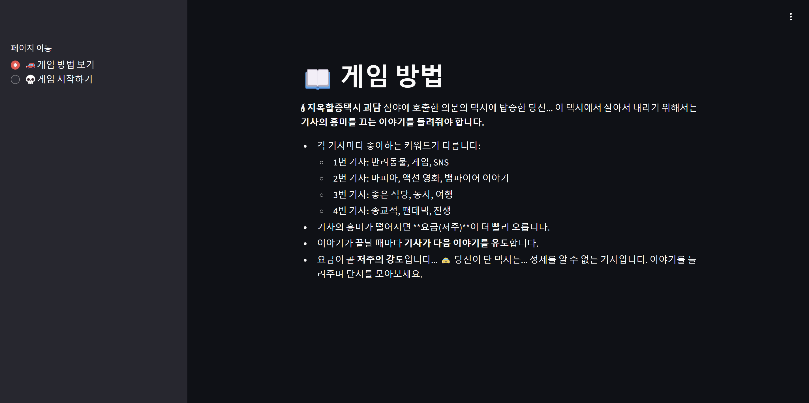
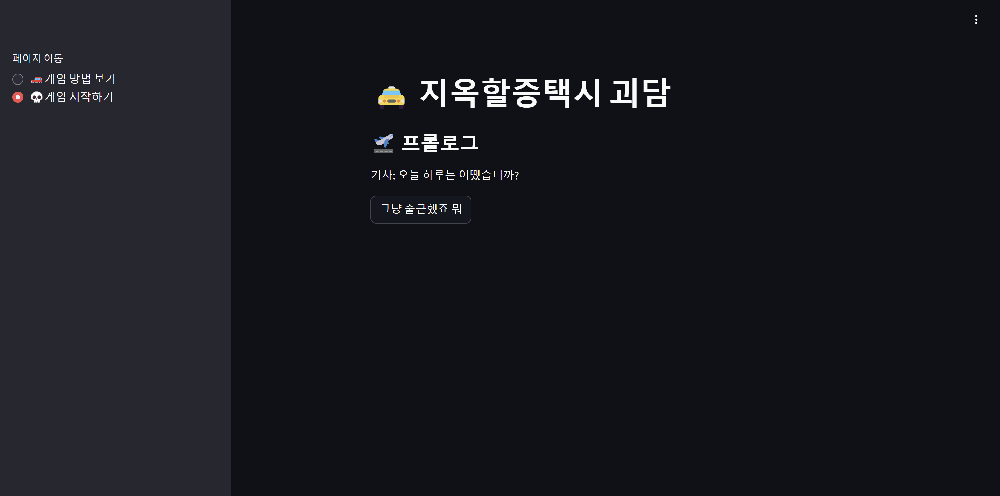
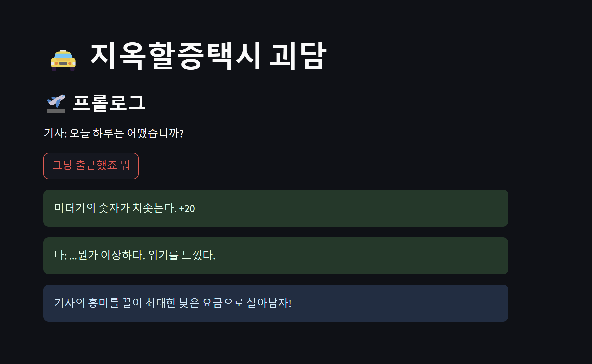
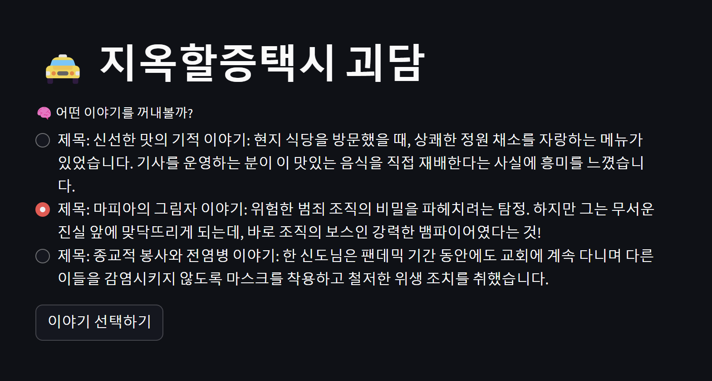
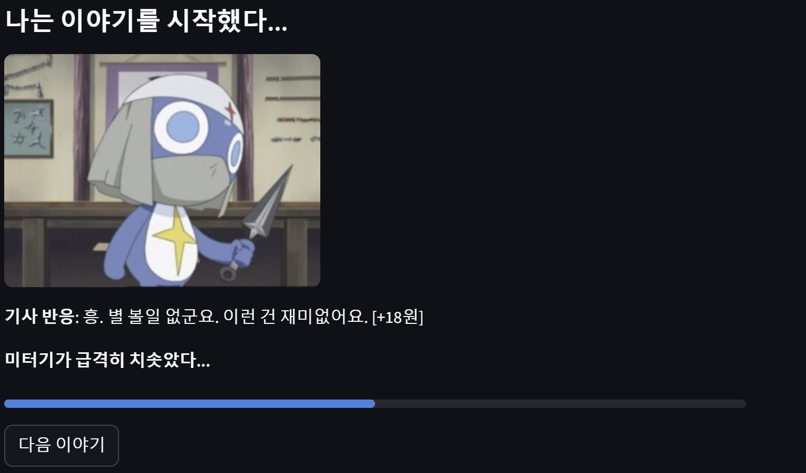
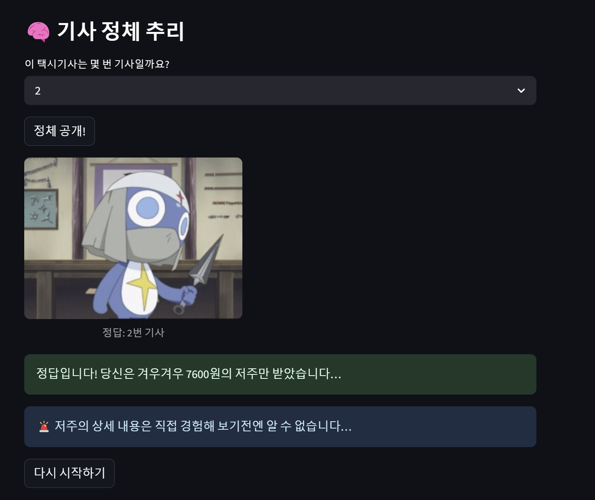
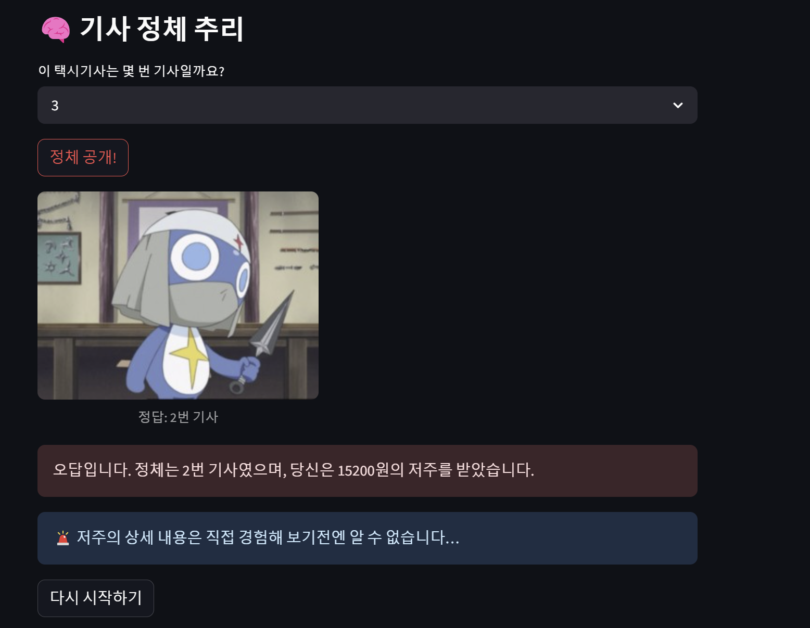

# 지옥할증택시🚗

## 🛑 개요

**〈지옥할증택시 괴담〉**은 심야에 특정 번호로 호출되는 정체불명의 택시에 얽힌 괴담을 중심으로 한 **스토리 기반 추리 게임**입니다. 이 택시에 탑승한 승객은 반드시 **저주**를 받으며, 저주의 수위는 **택시 요금**에 비례합니다.

## ⭐ 개발 기간 
2025.04.19 ~ 2025.04.24

<<<<<<< HEAD
## 구현 사이트
=======

## 👉 구현 사이트
>>>>>>> 4dd64f8 (add)
스트림릿 포트번호 : 69.30.85.98:22109

---

## 🛠️ 기술스택

| 기술명    | 역할 및 설명                                              | 뱃지 |
|-----------|---------------------------------------------------------|------|
| Python    | 전체 애플리케이션 개발, 게임 로직 구현                   |  |
| Streamlit | 웹 UI, 상태 관리, 인터랙티브 게임 구현                  |  |
| Ollama (LLM) | 기사 반응 및 이야기 자동 생성에 사용되는 대형 언어 모델 |  |
| Pillow (PIL) | 이미지 파일 처리 및 표시                                |  |
| random, os, time | 파이썬 표준 라이브러리, 유틸리티(랜덤, 경로, 타이밍 등) |  |


## 🎮 게임 진행 방식

- 승객은 택시 기사에게 **흥미로운 이야기를 들려주어야** 합니다.
- 총 세번의 이야기를 들려주어야 합니다.
- 기사의 흥미가 떨어질수록:
  - **미터기**가 더 빠르게 오릅니다.
- 기사들은 선호 키워드를 말하지 않으며, 승객은 미터기의 반응을 통해 **흥미 여부를 추리**해야 합니다.

---

## 🚖 택시 기사 정보

각 택시기사는 고유한 흥미 키워드를 가지고 있으며, 다음과 같습니다:

- **기사 1호**
  -  반려동물, 게임, SNS
- **기사 2호**
  - 마피아, 액션 영화, 뱀파이어 이야기
- **기사 3호**
  - 맛집집, 농사,여행
- **기사 4호**
  - 종교, 팬데믹, 전쟁

---

## ⏱️ 주의 사항

- 모든 택시는 정시에 도착합니다.
- 호출 시, 랜덤으로 도착 예정 시간이 정해지며 **최소 10분 ~ 최대 60분 후**로 설정됩니다.
- **예정 도착 시간과 차량 속도는 무관**합니다.
- 택시 기사는 먼저 말을 걸며, 반응만 합니다.

---

## 🎯 목표

- 어떤 기사인지 추리하세요.
- 기사의 흥미를 끌어 **최대한 저렴한 요금**으로 목적지에 도착하세요.
- 요금이 곧 **저주의 강도**를 결정합니다.

## 🧠 AI 응답 방식 요약

### 🔧 LLM 호출 함수

`ask_llm(driver_num, story)`  
- 실제 AI 모델(ollama LLM)에 프롬프트를 보내 기사 반응을 받아옵니다.

`generate_next_story(driver_num)`
- 기사별 키워드 기반 프롬프트를 생성하여, "제목 + 3줄 이내 이야기" 형식의 짧은 이야기를 LLM이 생성합니다.

---

## 📦 프롬프트 구조

프롬프트에는 다음 정보가 포함됩니다:

- 기사 번호
- 선호 키워드
- 기사 성격 (흥미/지루함 멘트)
- 사용자가 선택한 이야기(story)

### 📝 프롬프트 작성 조건

**기사**
- 기사 성격에 맞춘 반응 생성  
- 이야기의 흥미 여부 판단 (`high` / `low`)  
- 요금 증가치 계산:
  - **흥미로운 이야기**: `+3 ~ +7`
  - **지루한 이야기**: `+10 ~ +20`
  - 증가 이유 포함
- 기사 번호는 **절대 노출 금지**
- 결과는 아래의 포맷을 따라야 함

**승객(나)**
- 택시 기사 {driver_num}번이 흥미로워할 만한 짧은 이야기를 1개 만들어야함
- 제목 1개와, 제목과 관련된 3줄 이내의 짧은 이야기 1개로 구성
- 반드시 아래 형식만 지켜서 출력하세요. 불필요한 설명 금지

---

## 💬 AI 응답 예시 

**기사**

- 반응: 기사 캐릭터의 말풍선(멘트)

- 흥미도: high(흥미 있음) 또는 low(흥미 없음)

- 요금증가: 실제로 미터기에 더해질 정수값(예: 5, 17 등)

**승객(나)**

- 제목: (제목)
- 이야기: (3줄 이내 이야기)

---

## 🚀 실제 호출 방식

```python
response = ollama.chat(
    model='eeve-korean-10.8b',
    messages=[{"role": "user", "content": prompt}]
)
return response['message']['content']
```


## 🤖 게임 구현
### 게임 방법


- 
### 게임 시작 화면


- 
### 프롤로그


-
### 선택지 



### 기사의 반응 

- 이야기가 기사의 취향일 경우 미터기 숫자가 3~7 정도로 천천히 오르며
긍정적인 반응을 한다.



- 이야기가 기사의 취향이 아닐 경우 미터기 숫자가 10~20 정도로 빠르게 오르며
부정적인 반응을 한다.

### 추리가 정답일 때

-
### 추리가 오답일 때

- 오답일 시 받아야하는 본래 금액보다 2배 징수한다.
